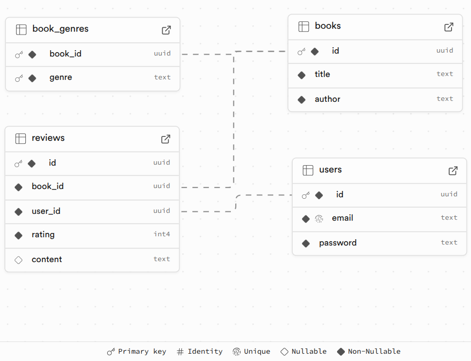

## Project setup and run instructions

**Step 1**
Clone the repository throught git cli

```
gh repo clone h4mmad/billeasy
```

```
cd billeasy
```

**Step 2**
Create a .env file with the following environment variables

```
DATABASE_URL=
JWT_SECRET=
```

**Step 3**
Install dependencies

```
npm install
```

**Step 4**
Run in dev mode

```
npm run dev
```

---

## Example API request

Postman: https://documenter.getpostman.com/view/20110000/2sB2x2KZvp#216c95fe-59d2-4c12-b5e3-03f32edf9035

### Design desicions & assumptions made

1. Relational database Postgresql is used
2. I thought should I include one genre for one book or a single book can be have multiple genres.
3. Then I thought, In real life a book can be part of multiple genres, ex. Goosebumps series is fiction and horror. Therefore, the database is designed to have multiple genres, instead of storing `genre` in a single column with books, a separate table `book_genre` is created with columns `book_id` and `genre`. Each row has a unique constraint. This can increase complexity for querying.
4. For endpoints that use filters and paginatin, filters are applied first and then pagination by using limit and offset.
5. Ratings for books is a whole number 1 to 5 inclusive of both.
6. Book genre is an enum used in application code rather than database, because if new genres need to be supported then only change it one place.
7. Incoming request to create books are validated using Zod schemas. Genres are only allowed if they are part of enum.

## Relationships and schema



#### `users`

1. `id` is primary key in `users` table
2. `email` has a unique constraint
3. `password` is stored after hashing and salting

#### `reviews`

1. `id` is primary key in `reviews` table
2. `book_id` and `user_id` has a unique constraint, this allows a user to post only one review for a book.
3. There is a check on `rating` where rating >= 1 and rating <=5.
4. `book_id` in reviews table is a foreign key which references `id` in `books` table, it has on delete cascade.
5. `user_id` in reviews table is a foreign key which references `id` in `users` table with on delete cascade.

#### `books`

1. `id` is primary key in `books` table
2. `title` is not null
3. `author` is not null

#### `book_genres`

1. `book_id` and `genre` are composite primary key.
2. `book_id` is foreign key references `id` in `books` table has on delete cascade.

#### things to do/think about

1. Book genre will be an enum, because for filtering it'll be easier and will enforce consistency, use enum and fail fast.

2. Should I include one genre for one book or a single book can be under multiple genres.

3. If multiple genres per book, how to store it in db
4. For genres keep an enum in application code rather than in db schema, because adding a new genre would require only altering application code

5. Filters work first and then pagination

6. Assume avg rating is for the book not per page of reviews

7. Assume rating given is whole number (ex. 4/5)

8. Users are allowed to update and delete their own review for a book, this is checked using reviews.user_id and request.userId

### Todos

- [ ] Set up custom error handler with Posgress specific codes (ex. 2305) and other
